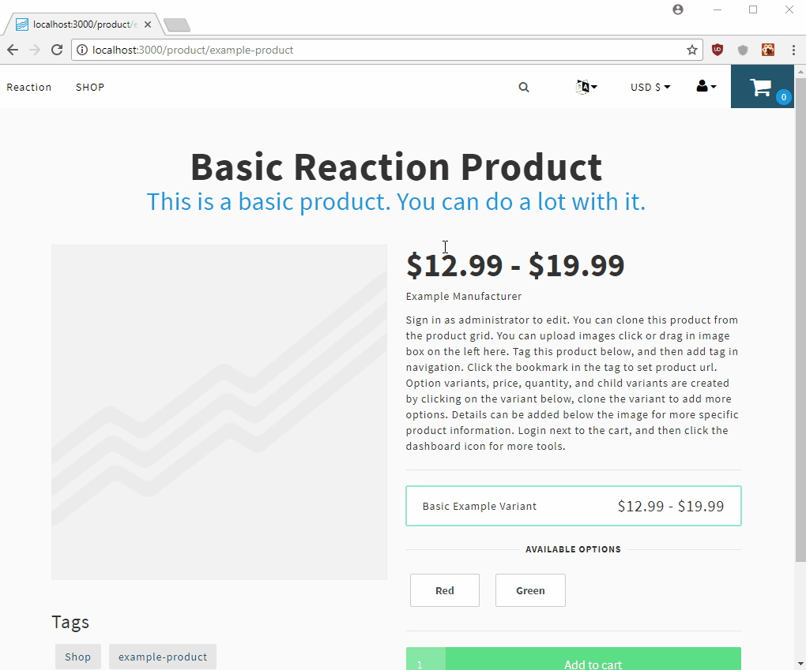

Runs a prerender server to render previews of Reaction Commerce pages, and saves them in an in-memory cache.  

### install

`git clone` this repo into /imports/plugins/custom and restart Reaction.  Requires Google Chrome/Chromium to be already installed on your system. 
